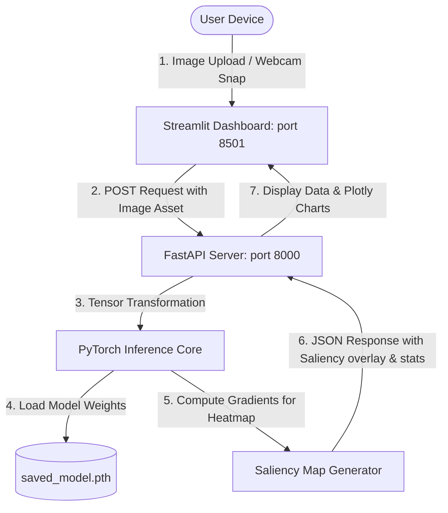

# Car Damage AI Assistant - System Report

This document provides a comprehensive report detailing the architecture, features, data workflow, and execution pipeline of the **Car Damage AI Assistant** suite.

---

## 1. System Architecture

The project is structured as a decoupled, multi-tiered AI application:



- **Frontend (Streamlit)**: Serves as the user-facing SaaS dashboard. It utilizes customized CSS injection for premium glassmorphism styling, gathers inputs (labor rates, vehicle tier), handles file uploads and webcam snapshots, and renders live data alongside Plotly visualization charts.
- **Backend (FastAPI)**: Lightweight, high-performance API server. It receives image assets, transforms them into PyTorch tensors, runs convolutional network inference, generates the visual attention saliency overlay, and maps class outputs to financial metadata in Indian Rupees (INR).
- **Core Deep Learning Module (PyTorch)**: Utilizes a custom **ResNet-50** deep neural network pre-trained on ImageNet and fine-tuned on labeled vehicle damage classes:
  - `F_Breakage`, `F_Crushed`, `F_Normal` (Front Damage Profiles)
  - `R_Breakage`, `R_Crushed`, `R_Normal` (Rear Damage Profiles)

---

## 2. Comprehensive Feature Set

### 🔍 Advanced Explainable AI (XAI)
- **Neural Saliency Heatmaps**: Calculates gradients of the predicted class score with respect to input pixels during the backward pass. High-intensity pixels (the ones that influenced the model's prediction the most) are color-mapped to red, providing visual auditability showing exactly where the model looked.

### 💰 Dynamic Cost Estimator (India Calibration)
- **Indian Rupee (₹) Base Rates**: Base cost intervals are configured directly in INR (ranging from ₹12,000 for minor rear damage up to ₹4,50,000 for critical front-end crush damages).
- **Three-Variable Calibration Matrix**:
  1. *Vehicle Class*: Economy (0.75x multiplier), Standard (1.0x), or Luxury (2.2x).
  2. *Labor Charge*: Dynamic sliding adjustment (₹300/hr to ₹3,000/hr).
  3. *Parts Logistics*: Aftermarket (-10%), Standard OEM (1.0x), or Premium Imported (+15%).

### 🛠️ Interactive Parts-Level Override Editor
- Dynamically populates checklists representing damaged components depending on the predicted region (e.g., bumper, headlamps, radiator, ADAS sensors for front hits).
- Toggling checklists dynamically modifies the cost calculation in real-time.

### 📉 Insurance NCB & Claims Audit Tool
- Compares immediate estimated repair costs against the value of resetting the user's **No Claim Bonus (NCB)** discount for the upcoming year (calculated against their annual premium).
- Provides an automated verdict telling the user whether it is cheaper to pay out-of-pocket or claim insurance.

### 📦 Bulk Inspection & Diagnostics Panel
- **Batch Processing**: Allows processing hundreds of images sequentially, rendering a tabular summary with CSV export.
- **Active Diagnostics**: Visualizes real-time metrics, system specifications, and a validation confusion matrix to gauge accuracy.

---

## 3. End-to-End Workflow

1. **Asset Acquisition**: The user uploads an image file or captures a live photo via their webcam inside the Streamlit dashboard.
2. **Request Packaging**: The frontend packs the bytes as a `multipart/form-data` payload and POSTs to `/predict` on the FastAPI backend.
3. **Tensor Preprocessing**: The FastAPI server resizes the input image to `224x224`, normalizes pixel channels matching ImageNet, and moves the tensor to the configured compute device (CUDA GPU or CPU).
4. **Neural Inference**: 
   - Runs a forward pass through the ResNet-50 network to output logits across the 6 target classes.
   - Computes a Softmax function to retrieve probability scores.
5. **Backpropagation (Saliency Map)**:
   - Sets `input_tensor.requires_grad = True` and computes gradients of the highest-scoring class logit.
   - Summarizes gradients along the color channels and normalizes values to a `[0, 255]` pixel array.
   - Overlays the gradient map onto the original image as a red/blue heatmap and encodes it in Base64 JPEG.
6. **Data Compilation**: Resolves pricing matrices, severity thresholds, and recommendations, returning a comprehensive JSON report.
7. **SaaS Rendering**: The dashboard updates metric cards, builds interactive Plotly cost breakdowns, and displays download links for claim logs.

---

## 4. How to Run the Project

### Phase 1: Install Dependencies
Run from the workspace directory:
```bash
pip install -r dataset/requirements.txt
```

### Phase 2: Start Backend Server
Navigate to the backend directory and launch Uvicorn:
```bash
cd dataset/backend
python -m uvicorn main:app --host 127.0.0.1 --port 8000
```

### Phase 3: Start Frontend Dashboard
Open a separate shell, navigate to the frontend directory, and launch Streamlit:
```bash
cd dataset/frontend
streamlit run app.py
```
*The dashboard will automatically open in your default browser at http://localhost:8501.*
